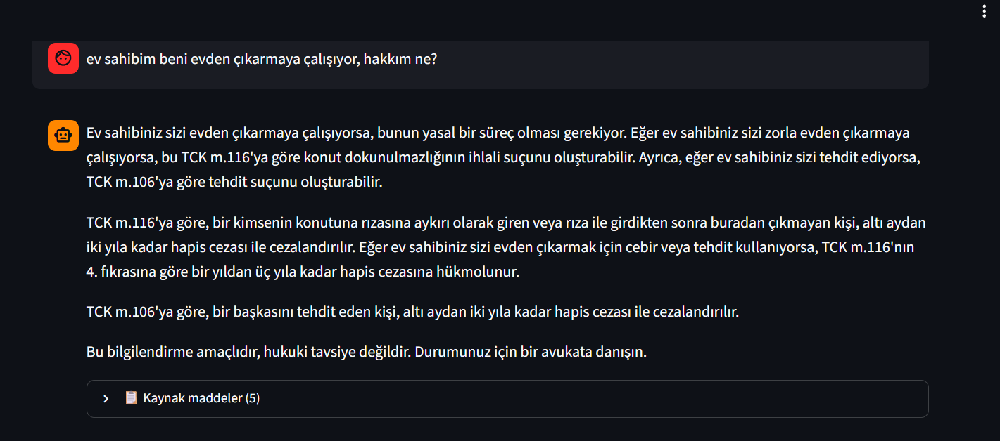
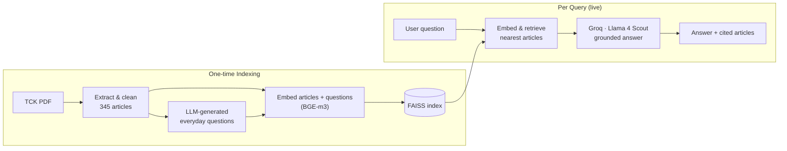

# AskLaw-RAG — Turkish Criminal Law Assistant


A Retrieval-Augmented Generation (RAG) assistant that answers **everyday-language questions** about the **Turkish Criminal Code** (*Türk Ceza Kanunu* — Law No. 5237). Ask in plain Turkish — *"my neighbor slapped me, what can I do?"* — and get an answer grounded in the actual statute, with the exact articles it relied on.

### 🔗 Live demo: **https://huggingface.co/spaces/borakosalay/Ask-Law-RAG**

---

## What it does

- Accepts questions written in **ordinary citizen language**, no legal jargon required.
- Retrieves the most relevant TCK articles and answers **strictly from their text**.
- **Cites its sources** — every answer shows which articles (e.g. *TCK m.86 — Kasten yaralama*) it used.
- **Refuses to guess.** If no relevant article is found, it says so instead of hallucinating.
- Always appends a disclaimer: this is information, **not legal advice**.

---

## How it works



### 1. RAG, not fine-tuning

For a legal tool, factual accuracy is non-negotiable. Fine-tuning a model to "memorize" the law invites hallucinated article numbers and penalties, and forces a retrain every time the law changes. RAG instead keeps the law in an external, searchable store and feeds the relevant text to the model at answer time. This makes answers **source-grounded, citable, and trivially updatable** — you just edit the knowledge base.

### 2. Building a clean knowledge base

The raw TCK PDF doesn't parse cleanly, so a dedicated extraction pipeline (`pdfplumber` + regex) handles the real-world messiness:

- **Robust article detection** across formatting variants (`Madde 81-`, `Madde 328. -`, different dash characters, and `Geçici Madde`).
- **Correct titles** — each article's heading is the line directly above its marker, not a fragile proximity guess.
- **No cross-contamination** — article bodies are sliced up to the *next article's title line*, so a following heading never bleeds into the previous article.
- **Structural awareness** — Book / Part / Chapter (`KİTAP/KISIM/BÖLÜM`) headers are detected and stripped, and chapter context is preserved as metadata.
- **Repealed-article flagging** — fully repealed (*mülga*) articles are marked `yururlukte: false`.
- **Appendix separation** — the trailing "non-incorporated provisions" section is split out instead of collapsing into one giant chunk.

Output: **345 articles** as JSONL, each with `{madde_no, tip, baslik, bolum, yururlukte, metin}`.

### 3. Bridging the vocabulary gap

The core retrieval challenge in legal RAG: citizens and statutes use **completely different words for the same thing**. A user types *"birini dövdüm"* ("I hit someone"); the law says *"kasten yaralama"* ("intentional injury") — zero lexical overlap. Pure semantic search on article text alone retrieves the wrong articles, dominated by surface features (e.g. the word *"komşum"* / "my neighbor" pulling results toward domestic-context articles).

**Solution:** an LLM generates dozens of realistic, everyday-language questions per article (*"my neighbor slapped me"*, *"someone threatened to kill me"*), each tagged with its source article. These questions are embedded and added to the index **alongside** the article texts. Now a colloquial query matches a similar generated question, which points straight to the correct article — closing the gap.

### 4. Embedding & retrieval

- **Embeddings:** [`BAAI/bge-m3`](https://huggingface.co/BAAI/bge-m3) — a strong multilingual model with solid Turkish support, run locally (no API limits).
- **Vector store:** FAISS `IndexFlatIP` over L2-normalized vectors (= cosine similarity). Exact search; 345 articles + generated questions is tiny.
- **Deduplicated retrieval:** the index contains both article and question vectors, so a query pulls **20 candidate vectors**, which are then collapsed to the **top 5 unique articles** before generation.

### 5. Grounded answer generation

The retrieved articles + the question are sent to **Groq's Llama 4 Scout** (`meta-llama/llama-4-scout-17b-16e-instruct`) with a strict system prompt:

- Use **only** the directly relevant retrieved articles — ignore the rest.
- Never invent information beyond the provided text.
- Always cite the article (e.g. *"TCK m.86'ya göre..."*).
- If the articles don't cover the question, say so rather than guess.
- Append the legal disclaimer.

Low temperature (`0.3`) keeps answers faithful and consistent. Groq's open-source models on free inference handle this well because the model is *reading* the supplied Turkish text, not generating law from scratch.

---

## Tech stack

| Layer | Choice |
|---|---|
| PDF extraction | `pdfplumber` + regex |
| Embeddings | `sentence-transformers` · `BAAI/bge-m3` |
| Vector store | `faiss-cpu` (`IndexFlatIP`, cosine) |
| Question generation | Groq LLM (everyday-language augmentation) |
| Answer generation | Groq · `llama-4-scout-17b-16e-instruct` |
| Frontend | Streamlit (chat UI + source viewer) |
| Hosting | Hugging Face Spaces (CPU Basic, free) |

---

## Project structure

```
.
├── app.py                  # Streamlit app: load index + RAG + chat UI
├── requirements.txt
├── tck_bilgi_tabani.jsonl  # Knowledge base: 345 articles with metadata
├── tck_sorular_zengin.jsonl# Generated everyday-language questions (per article)
├── tck.faiss               # FAISS index (articles + questions)
├── tck_meta.json           # Index metadata (records + full articles)
└── .streamlit/config.toml  # Dark theme (optional)
```

> The index (`tck.faiss` / `tck_meta.json`) is built from the knowledge base and the generated questions, then embedded with BGE-m3. The query model and the index model must match.

---

## Running locally

```bash
pip install -r requirements.txt

# provide your Groq API key (free: https://console.groq.com/keys)
export GROQ_API_KEY="gsk_..."        # Windows PowerShell: $env:GROQ_API_KEY="gsk_..."

streamlit run app.py                 # opens http://localhost:8501
```

`tck.faiss` and `tck_meta.json` must sit next to `app.py`. First launch downloads the BGE-m3 model (~2 GB), which takes a minute; later launches are fast. The API key is read from the environment — it is never stored in the code, and on Hugging Face Spaces it lives in the Space's **Secrets**.

---

## ⚠️ Disclaimer

This project is an **informational tool**, not a substitute for professional legal advice. Outputs can be incomplete or wrong and may not reflect the most recent amendments to the law. For any real legal matter, consult a licensed attorney. The authors accept no liability for decisions made based on this tool.

---

## License

Released under the MIT License. The Turkish Criminal Code itself is public legislation.
